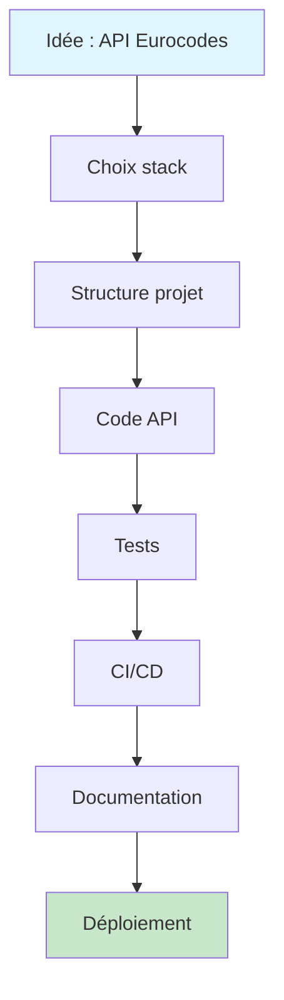

# Workflow Humain vs IA — Cheminement complet

> Ce document trace **chaque étape** de la construction de ce projet,
> en montrant comment l'IA l'a fait ET comment un humain peut le faire seul.

---

## Vue d'ensemble



---

## Étape 1 : Définir le problème

### Ce que l'IA a fait
L'utilisateur a fourni une stratégie détaillée (Madil4 Model) avec la stack, les endpoints, et les libs.
L'IA a lu cette spec et en a déduit l'architecture.

### Comment le faire sans IA

1. **Écrire le problème** sur papier :
   > "Les bureaux d'études utilisent Excel pour les calculs Eurocodes.
   > Je veux une API REST testable qui remplace ces feuilles."

2. **Lister les calculs** à exposer :
   - Poutre béton en flexion (EC2)
   - Poteau acier en flambement (EC3)
   - Fondation en portance (EC7)

3. **Choisir la stack** (voir ADR-001) :
   - Aller sur PyPI, chercher "eurocode" → trouver eurocodepy
   - Lire la doc : https://pcachim.github.io/eurocodepy/
   - Vérifier que Python 3.12+ est installé : `python --version`

**Temps estimé** : 1-2 heures de recherche

---

## Étape 2 : Créer la structure du projet

### Ce que l'IA a fait
Créé l'arborescence complète en une passe :
```
src/eurocode_calculator/{main,config,routers,services,schemas}/
tests/
docs/
.cursor/{rules,skills}/
.github/workflows/
```

### Comment le faire sans IA

```bash
# 1. Créer le dossier et le venv
mkdir eurocode-calculator && cd eurocode-calculator
python -m venv .venv
.venv\Scripts\activate

# 2. Créer pyproject.toml à la main
# Copier le modèle depuis : https://packaging.python.org/en/latest/tutorials/packaging-projects/
# Ajouter vos dépendances dans [project.dependencies]

# 3. Créer l'arborescence
mkdir -p src/eurocode_calculator/routers
mkdir -p src/eurocode_calculator/services
mkdir -p src/eurocode_calculator/schemas
mkdir -p tests
mkdir -p docs

# 4. Fichiers __init__.py vides
type nul > src\eurocode_calculator\__init__.py
type nul > src\eurocode_calculator\routers\__init__.py
type nul > src\eurocode_calculator\services\__init__.py
type nul > src\eurocode_calculator\schemas\__init__.py

# 5. Installer
pip install -e ".[dev]"
```

**Temps estimé** : 30 min

**Ressources** :
- FastAPI tutorial : https://fastapi.tiangolo.com/tutorial/
- Structure projet Python : https://packaging.python.org/

---

## Étape 3 : Écrire le premier endpoint

### Ce que l'IA a fait
1. Créé `schemas/beam.py` avec les modèles Pydantic
2. Créé `services/beam_service.py` avec la logique eurocodepy
3. Créé `routers/beam.py` qui connecte les deux
4. Enregistré le router dans `main.py`

### Comment le faire sans IA

#### 3a. Le schema (schemas/beam.py)

Lire la doc Pydantic : https://docs.pydantic.dev/latest/
```python
from pydantic import BaseModel, Field

class BeamVerifyULSRequest(BaseModel):
    concrete_grade: str = "C30/37"
    width_mm: float = Field(gt=0)
    height_mm: float = Field(gt=0)
    moment_knm: float
```

**Réflexion** : quels paramètres l'ingénieur entre dans son Excel ?
→ Section, matériau, sollicitations. C'est exactement ça.

#### 3b. Le service (services/beam_service.py)

Lire la doc eurocodepy : https://pcachim.github.io/eurocodepy/
```python
import eurocodepy as ec

concrete = ec.Concrete("C30/37")
print(concrete.fck)  # → 30 MPa
print(concrete.fcd)  # → 20 MPa (avec γc=1.5)
```

Ensuite, appliquer la formule de flexion de votre cours de RDM / BA :
```
M_Rd = 0.15 × fcd × b × d²
```

**Réflexion** : ouvrir votre cours EC2, trouver la clause, traduire en Python.

#### 3c. Le router (routers/beam.py)

Lire le tutorial FastAPI : https://fastapi.tiangolo.com/tutorial/first-steps/
```python
from fastapi import APIRouter
router = APIRouter(prefix="/beam", tags=["Poutre — EC2"])

@router.post("/verify-uls")
def post_verify_uls(request: BeamVerifyULSRequest):
    return verify_beam_uls(request)
```

#### 3d. Le main (main.py)

```python
from fastapi import FastAPI
app = FastAPI(title="Eurocode Calculator")
app.include_router(beam_router)
```

**Temps estimé** : 2-4 heures pour le premier endpoint (avec apprentissage)

---

## Étape 4 : Écrire les tests

### Ce que l'IA a fait
Créé 9 tests couvrant les 3 endpoints + health check, avec cas OK, FAIL, et validation.

### Comment le faire sans IA

Lire : https://fastapi.tiangolo.com/tutorial/testing/

```python
# tests/conftest.py
from fastapi.testclient import TestClient
from eurocode_calculator.main import create_app
import pytest

@pytest.fixture
def client():
    return TestClient(create_app())

# tests/test_beam.py
def test_beam_ok(client):
    response = client.post("/beam/verify-uls", json={
        "concrete_grade": "C30/37",
        "width_mm": 300, "height_mm": 500,
        "moment_knm": 50
    })
    assert response.status_code == 200
    assert response.json()["verified"] is True
```

**Méthode** : pour chaque endpoint, calculer manuellement un cas simple
avec votre calculatrice, puis vérifier que l'API retourne le même résultat.

**Temps estimé** : 1-2 heures

---

## Étape 5 : CI/CD

### Ce que l'IA a fait
Créé `.github/workflows/ci.yml` avec matrix Python 3.12/3.13, ruff, pytest, codecov.

### Comment le faire sans IA

1. Aller sur https://github.com/features/actions
2. Créer un repo GitHub, pousser le code
3. Copier un workflow template :
   https://github.com/actions/starter-workflows/tree/main/ci
4. Adapter pour Python :
   - `actions/setup-python@v5`
   - `pip install -e ".[dev]"`
   - `pytest`

**Temps estimé** : 1 heure (première fois), 15 min ensuite

---

## Étape 6 : Docker

### Ce que l'IA a fait
Créé un Dockerfile minimal Python 3.12-slim.

### Comment le faire sans IA

Lire : https://fastapi.tiangolo.com/deployment/docker/

```dockerfile
FROM python:3.12-slim
WORKDIR /app
COPY . .
RUN pip install -e .
CMD ["uvicorn", "eurocode_calculator.main:app", "--host", "0.0.0.0", "--port", "8000"]
```

```bash
docker build -t eurocode-calculator .
docker run -p 8000:8000 eurocode-calculator
```

**Temps estimé** : 30 min

---

## Étape 7 : Documentation

### Ce que l'IA a fait
Créé 10+ fichiers de documentation : cours, handoff, workflow, ADR.

### Comment le faire sans IA

Minimum viable :
1. **README.md** — comment installer et lancer (30 min)
2. **Docstrings** dans les services — expliquer les hypothèses de calcul (1h)
3. **Swagger** — auto-généré par FastAPI, rien à faire

Le reste (cours, handoff) est un bonus pour la reprise par IA ou l'apprentissage.

---

## Tableau récapitulatif

| Étape | Avec IA | Sans IA | Gain IA |
|-------|---------|---------|---------|
| Structure projet | 5 min | 30 min | 6x |
| 1er endpoint | 10 min | 3h | 18x |
| 3 endpoints | 20 min | 1 jour | 24x |
| Tests | 10 min | 2h | 12x |
| CI/CD | 5 min | 1h | 12x |
| Docker | 2 min | 30 min | 15x |
| Documentation | 15 min | 1 jour | 32x |
| **Total** | **~1h** | **~3-4 jours** | **~30x** |

### Ce que l'IA ne remplace PAS

- **Validation des calculs** : toujours vérifier contre la norme et un cas manuel
- **Choix métier** : quels calculs exposer, quelles hypothèses simplificatrices
- **Compréhension** : lire les cours pour comprendre CE QUE fait le code
- **Revue de code** : relire ce que l'IA produit, surtout les formules

---

## Exercice pratique

Pour vérifier que vous avez compris, essayez de :

1. Calculer manuellement `M_Rd` pour C30/37, b=300mm, h=500mm
2. Appeler l'API et comparer le résultat
3. Ajouter un test avec vos valeurs manuelles
4. Modifier `gamma_c` à 1.45 et observer l'impact

Si les 4 étapes fonctionnent, vous maîtrisez le workflow.

---

## Journal des sessions — Humain vs IA

> **Règle du projet** : chaque action (demande utilisateur, réponse IA, commandes humaines)
> est consignée ici avec le cheminement IA et le cheminement humain équivalent.
> Mettre à jour ce journal **à chaque session**.

---

### SESSION-002 — 2026-06-30 — Git init + premier lancement API

#### Demande utilisateur

> « J'ai fait le git init. Tout ce que tu fais doit être documenté à chaque fois
> (eurocode-calculator, ma demande, ce que tu fais, comment le faire en humain)
> à la suite dans le doc IA vs humain. »

#### Ce que l'humain a fait

| # | Action | Commande / résultat |
|---|--------|---------------------|
| 1 | Init git au niveau `Projet_1` | `git init` → repo dans `C:/Users/hamed/OneDrive/Bureau/Projet_1/.git/` |
| 2 | Entrer dans le projet | `cd .\eurocode-calculator\` |
| 3 | Activer le venv | `.venv\Scripts\activate` |
| 4 | Lancer l'API en dev | `uvicorn eurocode_calculator.main:app --reload` |
| 5 | Tester dans le navigateur | `GET /` → 200, `GET /docs` → 200, Swagger chargé |

**Logs serveur observés :**
```
INFO: Started reloader process [55132] using WatchFiles
INFO: Application startup complete.
127.0.0.1:59484 - "GET / HTTP/1.1" 200 OK
127.0.0.1:53732 - "GET /docs HTTP/1.1" 200 OK
127.0.0.1:53732 - "GET /openapi.json HTTP/1.1" 200 OK
```

**Note** : `GET /favicon.ico` → 404 est normal (pas de favicon configurée).

#### Comment le faire sans IA (pas à pas humain)

**A. Initialiser Git**

```powershell
# Option A — repo parent (ce que tu as fait) : tout Projet_1 versionné
cd C:\Users\hamed\OneDrive\Bureau\Projet_1
git init

# Option B — repo dédié par projet (stratégie Madil4, 1 repo = 1 vitrine)
cd C:\Users\hamed\OneDrive\Bureau\Projet_1\eurocode-calculator
git init
```

| Option | Avantage | Inconvénient |
|--------|----------|--------------|
| A — `Projet_1/` | Un seul repo pour toute la constellation | Mélange plusieurs projets futurs |
| B — `eurocode-calculator/` | Repo GitHub indépendant, portfolio propre | Un `git init` par projet |

**B. Premier commit (à faire ensuite)**

```powershell
cd C:\Users\hamed\OneDrive\Bureau\Projet_1
git add eurocode-calculator/
git status          # vérifier que .venv/ n'apparaît PAS (gitignore)
git commit -m "feat: initialiser eurocode-calculator API Eurocodes"
```

**C. Lancer l'API localement**

```powershell
cd eurocode-calculator
.venv\Scripts\activate
uvicorn eurocode_calculator.main:app --reload
```

| Élément | Rôle |
|---------|------|
| `--reload` | Redémarre l'API quand tu modifies le code |
| Port 8000 | Défaut Uvicorn — http://localhost:8000 |
| `/docs` | Swagger UI auto-généré par FastAPI |
| `/openapi.json` | Schéma OpenAPI (utilisé par Swagger) |

**D. Vérifier que tout fonctionne**

1. Navigateur → http://localhost:8000/ → JSON avec la liste des endpoints
2. Navigateur → http://localhost:8000/docs → interface Swagger
3. Terminal (autre fenêtre) → `pytest` → 9 tests verts
4. Swagger → `POST /beam/verify-uls` → Try it out → Execute

#### Ce que l'IA a fait (cette session)

| # | Action | Fichier modifié |
|---|--------|---------------|
| 1 | Ajout de ce journal SESSION-002 | `docs/03-WORKFLOW-HUMAIN-VS-IA.md` |
| 2 | Mise à jour du handoff (état actuel) | `docs/02-HANDOFF-IA.md` |
| 3 | Création relevé de session détaillé | `docs/sessions/SESSION-002-git-lancement.md` |
| 4 | Règle « documenter chaque action » | `AGENTS.md` |

#### Prochaine étape suggérée

```powershell
# Depuis Projet_1 (repo déjà initialisé)
git add eurocode-calculator/
git commit -m "feat: initialiser eurocode-calculator — API Eurocodes V0.1"
# Puis créer le repo sur GitHub et : git remote add origin <url> && git push -u origin master
```

